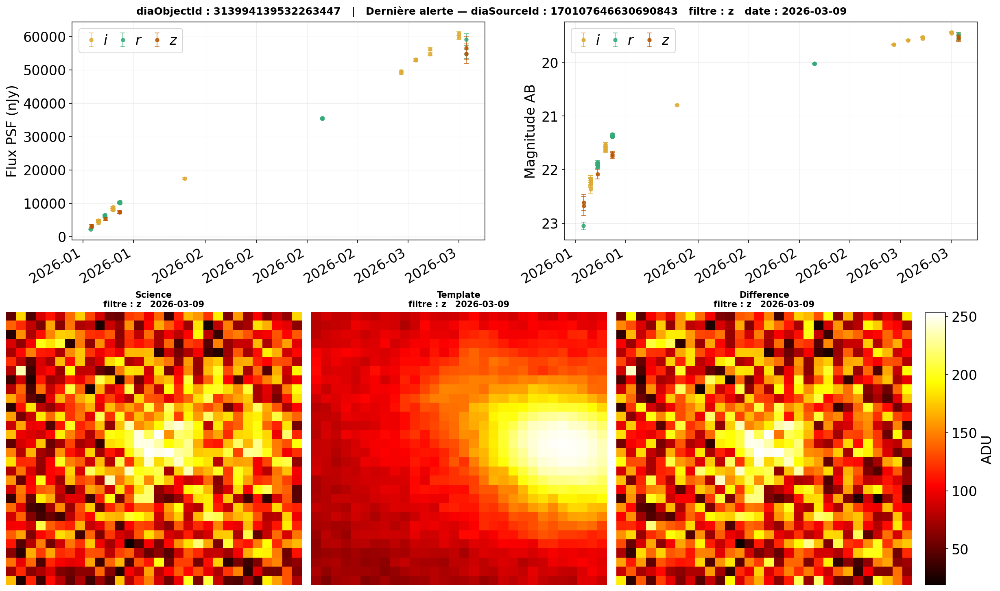
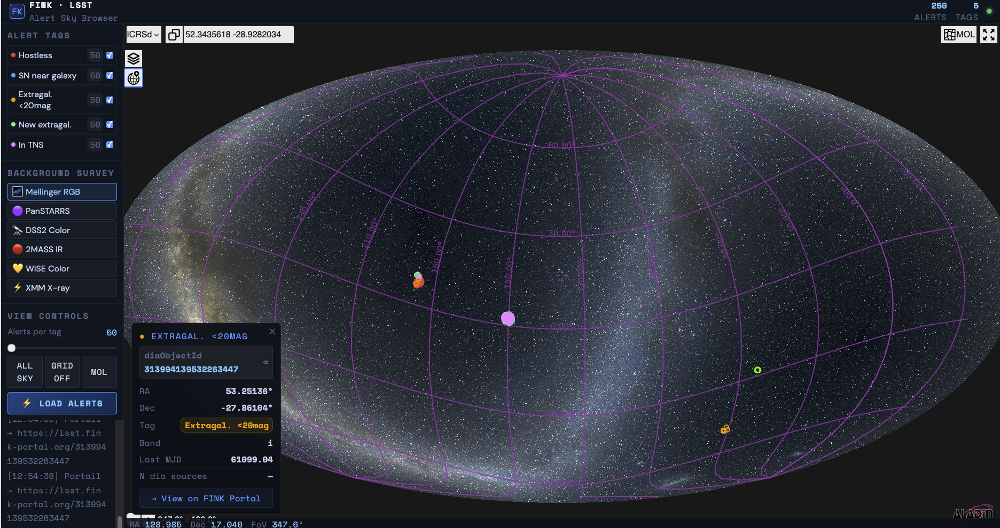

# Getting Started with FINK LSST Alerts: A Practical Guide Using LLMs

The FINK broker now processes alerts from **Rubin/LSST**, in addition to the previously handled ZTF alerts. If you are familiar with the ZTF version of the broker, you’ll notice that the API has evolved and now requires some adjustments. Focusing on Rubin, for new newcomers, the [LSST FINK portal](https://lsst.fink-portal.org/) and its [API documentation](https://api.lsst.fink-portal.org/) can be overwhelming at first. Where to start?

This news is **not a step-by-step tutorial**, but rather a practical approach using **free LLMs** (like [Claude Desktop](https://www.anthropic.com/claude), [Mistral AI](https://mistral.ai/), or [ChatGPT](https://chatgpt.com/)) to quickly get hands-on with **live alerts** (ie. we do not cover the use of downloaded data). The expectations and interactions with LLMs vary from person to person, but here’s some concrete examples using **Claude Desktop** to generate a Jupyter notebook for working with LSST alerts.

---

## Step 1: Generate a Notebook to Retrieve and Plot Light Curves and Cutouts

**Prompt for your LLM:**
> *"Use the FINK LSST API (`https://api.lsst.fink-portal.org/swagger.json`) to create a Jupyter notebook that retrieves the light curves for the **n most recent `sn_near_galaxy_candidate` alerts**. For each alert, plot the flux and its error, distinguishing the `ugrizy` filters with different colors."*

Claude will generate a file like `fink_lsst_lightcurves.ipynb`. The notebook will likely work out of the box, but you may want to adjust the plot styling, axes, or switch between flux and AB magnitude representations. You can either edit the code directly or ask your LLM to generate a patch for you.

**Key API endpoints used:**
- `/api/v1/tags` to fetch the most recent alerts.
- `/api/v1/sources` to retrieve unique `diaObjectId` data, including `midpointMjdTai`, `psfFlux`, `psfFluxErr`, and `band`.

---

## Step 2: Add Cutouts to Your Analysis

**Prompt for your LLM:**
> *"Now, let’s include the cutouts (Science, Template, Difference) for the selected alerts. Create functions to display these cutouts on a single line, using the same colormap (`hot`) for all three images. Include the cutout type and filter in the title."*

Claude will discover the need for the `/api/v1/cutouts` endpoint.

---

## Step 3: Build a Comprehensive Notebook

Once the basics are working, you can refine your approach:

**Prompt for your LLM:**
> "Based on `fink_lsst_lightcurves.ipynb`, create an advanced notebook that, for each object, generates a single figure with:
> 1. The light curves (flux and AB magnitude) on the first row.
> 2. The three corresponding cutouts (Science, Template, Difference) on the second row.
> Include in the title: `diaObjectId`, `diaSourceId`, cutout types, filter, and date of the last alert."

This will produce plots like those available on the FINK portal:

*Example: Light curves (flux and AB magnitude) and cutouts.*

---

**Important Notes: API has changed**
The FINK LSST alerts use a mix of variable formats (e.g., `r:XYZ` for LSST-type variables, `f:XYZ` for FINK-type variables) in contrast to ZTF which originaly used `i:XYZ`. So, always remind your LLM to use the **new API endpoints** to avoid confusion with older ZTF-style data.

---
## 🚀 What Notebooks Can You Build with FINK LSST Alerts?

Once you’ve gotten the hang of the basics, you might wonder: **What else can I do with LSST alerts in FINK?**? 
Here is a new prompt as simple as:
>"What notebooks can you suggest for working with LSST alerts?"

Here’s a selection of notebooks that Claude may give you covering both basic and advanced analyses:

### **Group 1: General Exploration**
- **[fink_lsst_multitag_stats.ipynb](https://github.com/USER/fink_lsst_multitag_stats.ipynb)**
  Compare multiple tags: number of alerts/unique objects, filter distributions, RA/Dec distributions, and median flux. Includes a visual summary figure with side-by-side subplots for quick comparison.

- **[fink_lsst_nightcurve.ipynb](https://github.com/USER/fink_lsst_nightcurve.ipynb)**
  Night-by-night monitoring: Plot the number of alerts per tag and filter over time (MJD → date). Useful to identify active nights, observation gaps, and the evolution of the alert stream since LSST data began in FINK.

- **[fink_lsst_scores.ipynb](https://github.com/USER/fink_lsst_scores.ipynb)**
  Classification scores table: Retrieve Fink score columns (e.g., `rf_snia_vs_nonia`, `snn_snia_vs_nonia`) and display them as a heatmap + histograms. Ideal for selecting top SN Ia candidates.

- **[fink_lsst_conesearch.ipynb](https://github.com/USER/fink_lsst_conesearch.ipynb)**
  Interactive cone search: Input RA/Dec + radius (arcmin), retrieve all Fink objects in the field, display them on a local map (gnomonic projection), and show light curves/cutouts for found objects.

---

### **Group 2: Advanced Analyses**
- **[fink_lsst_tns.ipynb](https://github.com/USER/fink_lsst_tns.ipynb)**
  TNS cross-match: Retrieve `in_tns` alerts, display TNS types (AT, SN Ia, SN II, etc.), compare Fink score distributions for confirmed vs. unconfirmed objects. Includes a Mollweide map colored by TNS type.

- **[fink_lsst_new_transients.ipynb](https://github.com/USER/fink_lsst_new_transients.ipynb)**
  New transients (<48h): Focus on `extragalactic_new_candidate`, displaying light curves from the earliest detections. Prioritizes alerts from the last 24 hours.

- **[fink_lsst_hostless.ipynb](https://github.com/USER/fink_lsst_hostless.ipynb)**
  Hostless candidates: Visualize spatial distribution (Mollweide map), compare photometric properties with `sn_near_galaxy_candidate`, and show cutouts highlighting the absence of extended sources in the Template.

- **[fink_lsst_forced_photometry.ipynb](https://github.com/USER/fink_lsst_forced_photometry.ipynb)**
  Forced photometry: For the brightest objects in any tag, retrieve forced photometry points (before official detection) via `/api/v1/forcedphotometry` and display them combined with detections on the same light curve.

---
**Endpoints used in these notebooks:**
All the notebooks generated were ready to go, but as for the first example, they can be refined once you dive into the code. At the end Claude would have given you the way to access the following endpoints 
`/api/v1/tags`, `/api/v1/sources`, `/api/v1/schema`, `/api/v1/cutouts`, `/api/v1/fp`, `/api/v1/conesearch`, `/api/v1/resolver`

---
## Beyond Notebooks: Build a Web App!

Want to go further? With Claude and Mistral, you can design a **JavaScript web app** for a Interactive sky map to visualize and interact with LSST alerts. *(Note: `diaObjectId` is encoded as a 64-bit integer, but JavaScript only handles 53-bit integers. Ask Mistral for a workaround!)*. For instance it uses
- Mellinger RGB background – the same Milky Way photograph 
- Aladin Lite via ipyaladin – mouse wheel zoom, mouse rotation, native HiPS
- Multi-tags – multiple FINK tags, each with its own color
- Click on a point → popup with alert details

*Alert Sky Browser: Filter by tag, view spatial distribution, and access light curves/cutouts interactively.*

---
## Start Exploring!

Now are you ready to dive in? Use your favorite LLM to generate a notebook tailored to your needs, or adapt the examples above.

---
*Have fun exploring the universe with FINK LSST alerts!*
